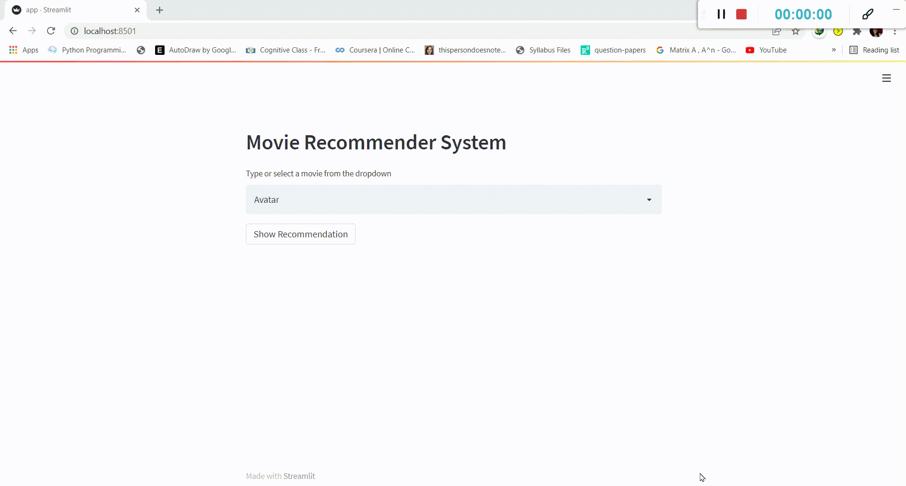

# Movie Recommendation System

This recommendation system is made on 4000+ movies features. After pre-processing of all features converted them into CountVectorizer vector. Then applying cosine similarity between these vectors and filtering top 5 similar vectors. Then fetching top 5 movies image from tmbdAPI and integrating them with streamlit. For better understanding look at below demo.

## Requirements

- pip install -r requirements.txt
  
## Run Locally

Clone the project

```bash
  git clone https://github.com/bhawna94110/Movie_recommendation
```

Go to the project directory

Install dependencies

```bash
  install above packages
```

Run streamlit run app.py


## Tech Stack : Streamlit, NLP, Pandas, Recommendation Engine


## Demo
                     

  
## Authors

- [@bhawana](https://www.github.com/bhawna94110)

  

  
## 🔗 Links
[](https://bhawana.netlify.com/)

[](https://www.linkedin.com/in/kbhawna/)


  
  
